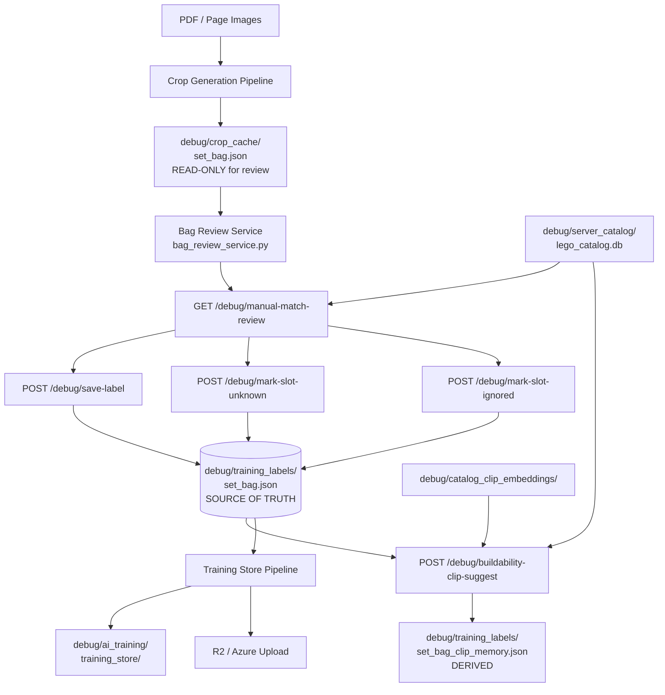

# Architecture

## Overview

This is a FastAPI application (`clean/main.py`) that provides a web-based pipeline for:

1. Ingesting LEGO instruction PDFs
2. Detecting and cropping part callout regions from instruction pages
3. Allowing a human reviewer to label each part slot (Bag Review)
4. Storing authoritative human-reviewed labels as training data
5. Running CLIP-based similarity suggestions to assist review
6. Exporting training packs and uploading them to cloud storage (R2 / Azure)

The app is **not** a production user-facing product. It is a developer/annotation tool.

---

## Major Subsystems

### 1. Web Server

- Framework: **FastAPI**
- Entry point: `clean/main.py`
- Routers registered at startup; all route logic lives in `clean/routers/`

### 2. Bag Review Pipeline

The core human-in-the-loop workflow.

- Service: `clean/services/bag_review_service.py`
- Router: `clean/routers/instruction_debug.py` (routes prefixed `/debug/`)
- Source of truth: `debug/training_labels/{set_num}_bag{bag}.json`
- Input (read-only): `debug/crop_cache/{set_num}_bag{bag}.json`
- UI: `GET /debug/manual-match-review`

### 3. Crop Generation Pipeline

Detects part callout crops from instruction pages and writes a crop cache.

- Router: `clean/routers/workflow.py`, `clean/routers/debug.py`
- Writes: `debug/crop_cache/{set_num}_bag{bag}.json`
- Reads: PDF page images from the loaded set

### 4. Training Pipeline

Bundles reviewed labels into training packs for model training.

- Services: `clean/services/training_store_service.py`, `clean/services/training_bundle_index_service.py`, `clean/services/training_cloud_sync_service.py`
- Router: `clean/routers/instruction_debug.py` (routes prefixed `/debug/training-store/`)
- Storage: `debug/ai_training/training_store/`, `debug/ai_training/analysis_bundles/`
- Database: `debug/ai_training/ai_training.sqlite`

### 5. Suggestion Pipeline

CLIP-based top-N part suggestions to assist the human reviewer.

- Router: `clean/routers/instruction_debug.py`
- Key route: `POST /debug/buildability-clip-suggest`
- Reads: `debug/training_labels/{set_num}_bag{bag}.json` (labels, read-only for suggestion)
- Reads: `debug/training_labels/{set_num}_bag{bag}_clip_memory.json` (derived CLIP memory)
- Reads: `debug/catalog_clip_embeddings/` (catalog embeddings)
- May write: CLIP memory file (derived, not authoritative state)
- Must NOT write: `training_labels` review state

### 6. Catalog / Embedding Pipeline

Pre-computed catalog data and CLIP embeddings for part matching.

- Catalog DB: `debug/server_catalog/lego_catalog.db`
- Catalog embeddings: `debug/catalog_clip_embeddings/embeddings.npy`, `items.json`, `manifest.json`
- Generation route: `POST /debug/generate-catalog-clip-embeddings`

### 7. Confirmed Memory Index

Cross-bag confirmed-part embedding index (derived from training store DB).

- Service: `clean/services/confirmed_memory_service.py`
- Output: `debug/confirmed_memory/confirmed_memory_embeddings.npy`, `confirmed_memory_items.json`

---

## Data Storage Locations

| Path | Purpose | Writable by |
|---|---|---|
| `debug/training_labels/{set_num}_bag{bag}.json` | **Bag Review source of truth** | `bag_review_service` only |
| `debug/training_labels/{set_num}_bag{bag}_clip_memory.json` | Derived CLIP memory | `buildability-clip-suggest` route |
| `debug/training_labels/{set_num}_manual_color_calibration.json` | Manual colour calibrations | `save-manual-color-calibration` route |
| `debug/crop_cache/{set_num}_bag{bag}.json` | Crop detection output (input to review) | Crop generation pipeline |
| `debug/catalog_clip_embeddings/` | Catalog CLIP embeddings | `generate-catalog-clip-embeddings` |
| `debug/catalog_maps/` | Per-set element maps | Catalog pipeline |
| `debug/ai_training/ai_training.sqlite` | Local SQLite file (legacy / unclear role; `training_bundle_index_service` connects via `psycopg` / PostgreSQL, not this file) | Training store service |
| `debug/ai_training/training_store/` | Training pack bundles | Training store service |
| `debug/ai_training/analysis_bundles/` | Per-crop analysis bundles | Training store service |
| `debug/ai_training/step_segmented_cutouts/` | Step-masked slot images | Segmentation pipeline |
| `debug/ai_training/part_cutouts/` | Part cutout images | Segmentation pipeline |
| `debug/confirmed_memory/` | Cross-bag confirmed memory index | `confirmed_memory_service` |
| `debug/server_catalog/lego_catalog.db` | LEGO part catalog | External / catalog tool |
| `debug/clip_probe_crops/` | Manual CLIP probe crops | Debug tool |
| `debug/clip_probe_reports/` | CLIP probe report images | Debug tool |
| `debug/bag_truth.db` | Legacy bag truth store (SQLite) | `bag_truth_store.py` |
| `debug/bag_inspector.db` | Bag inspector DB | Inspector tool |
| `debug/catalog_match_feedback/` | Catalog match feedback records | `POST /debug/catalog-match-feedback` |
| `debug/clip_training_embeddings/` | CLIP embeddings for training crops | `POST /debug/generate-training-clip-embeddings` |
| `debug/70618/full_bag_scan.json` | Bag scan output for set 70618 | Workflow scan pipeline |
| `tools/a2b_mcp_server.py` | MCP server tool (standalone script) | Manual / external |
| `tools/a2b_clip_match_probe.py` | CLIP match probe tool (standalone script) | Manual / debug |

---

## System Diagram

---

## Router Map

| Router file | Prefix / domain |
|---|---|
| `clean/routers/home.py` | `/` |
| `clean/routers/instruction_debug.py` | `/debug/` — bag review, training store, CLIP |
| `clean/routers/workflow.py` | `/api/` — bag scans, set workflow |
| `clean/routers/debug.py` | `/debug/` — page analysis, visual labs |
| `clean/routers/load_set.py` | `/debug/load-set` |
| `clean/routers/set_scan.py` | `/api/scan-set-candidates` |
| `clean/routers/gap_scan.py` | `/api/gap-scan` |
| `clean/routers/gap_review.py` | `/gap-review`, `/debug/gap-review` |
| `clean/routers/mask_review.py` | `/debug/mask-review` |
| `clean/routers/step_debug.py` | `/debug/step-*` |
| `clean/routers/step_bag_scan.py` | `/api/step-bag-scan` |
| `clean/routers/step_bag_openai_scan.py` | `/api/step-bag-scan-openai-verify` |
| `clean/routers/debug_truth.py` | `/api/debug/truth` |
| `clean/routers/analyzer_scan.py` | `/debug/scan-set-with-analyzer` |
| `clean/routers/sequence.py` | `/api/sequence-scan`, `/api/analyze-gap-page` |
