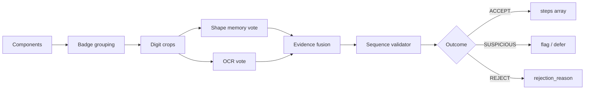

# Step Digit Shape Memory Plan

Design plan for a **Step Digit Shape Memory** layer in Stage 4 step-badge OCR.

**Date:** 2026-06-16  
**Status:** DESIGN ONLY — no runtime patches, no pipeline rerun  
**Goal:** Learn verified shapes of printed step-number digits so OCR mistakes like **424→474**, **325→345**, and **472→44** can be corrected or flagged before they enter the trusted sequence chain.  
**Rule alignment:** `docs/RULEBOOK.md` § SP6 (OCR is evidence, not truth); `reports/SEQUENCE_VALIDATOR_IMPLEMENTATION_PLAN.md` (sequence validator is downstream gate, not oracle)

---

## 1. Problem statement

Current Stage 4 (`step_map_scan.mjs`) reads step numbers by:

1. Connected-component detection → visual grouping into badge boxes
2. Tesseract OCR on whole-badge crops (multiple threshold variants)
3. Component-count guards (digit count vs OCR string length)
4. Same-page sequential OCR correction (sequence inference — to be gated)
5. Gap recovery and outlier rejection

OCR alone repeatedly misreads structurally similar digits on real proof pages:

| Page | Printed | OCR | Failure | Digit confusion |
|---:|---:|---:|---|---|
| 186 | 325 | 345 | False high anchor | 2↔4 |
| 189 | 331 | 351 | False high anchor | 3↔5 |
| 237 | 424 | 474 | Cross-bag poison | 2↔7 |
| 271 | 472 | 44 | Backwards fragment | 7 dropped; slash noise |

The sequence validator (SP1–SP6) can **reject** implausible reads but cannot recover the printed digit without independent evidence. Shape memory supplies that evidence from **verified digit appearance** accumulated per instruction set.

**Principle:** Shape memory is **evidence**, not truth. Human-confirmed parity truth wins. Sequence plausibility remains a separate vote.

---

## 2. Pipeline order (target)

Insert shape memory **after** visual grouping, **before** sequence validation:

```text
connected components
  → visual badge grouping          (existing: groupComponents, mergeNeighboringGroups)
  → per-digit crop extraction      (new: split group box into digit slots)
  → digit shape memory vote        (new: compare each slot against verified templates)
  → OCR vote                       (existing: readPrintedStepNumber, per-badge + per-slot optional)
  → evidence fusion                (new: combine shape + OCR into candidate step_number)
  → sequence validator             (planned: validateSequencePlausibility, SP1–SP6)
  → accept / suspicious / reject
```



**Hook location (future):** `step_map_scan.mjs` → `analyzePage()`, between badge OCR assignment (~L611–631) and `steps[]` assembly (~L644), same window as the sequence validator.

---

## 3. Cropping individual digit components

### 3.1 Source geometry

Reuse existing component pipeline in `collectStepGroups()`:

| Stage | Existing function | Output |
|---|---|---|
| Pixel CC | `componentBox()` | Per-glyph `{ x, y, w, h, pixels }` |
| Baseline sort | `sortComponentsForGrouping()` | Left-to-right digit order within row |
| Badge merge | `groupComponents()` + `mergeNeighboringGroups()` | Badge `step_box` + `components` count |

Shape memory operates on **individual components** inside an accepted badge group, not on the whole badge crop alone.

### 3.2 Digit slot assignment

For each primary badge group `G` with `components = N`:

1. Collect member components already merged into `G` (preserve list during grouping — today only count is kept; implementation must retain component bboxes).
2. Sort by `x` (existing baseline sort).
3. Assign `digit_index` 0…N−1 left-to-right.
4. If `N === 0` (legacy path): fall back to equal-width horizontal slices of `G.step_box` as weak slots — **SUSPICIOUS** provenance only; do not write to verified memory.

### 3.3 Crop extraction

For each digit slot `D`:

| Step | Action |
|---|---|
| 1 | Pad bbox by 2px (clamped to page bounds) |
| 2 | Extract from page PNG via sharp (same source as step OCR) |
| 3 | Normalize to canonical size **32×48** greyscale (preserve aspect; letterbox) |
| 4 | Binarize with set-adaptive threshold (store both raw grey and binary PNG) |
| 5 | Record `badge_bbox` = parent group box, `bbox` = digit slot box (page coords) |

**Naming convention:**

```text
debug/step_digit_memory/{set_num}/crops/{page:03d}_{step:03d}_d{digit_index}_{digit_label_or_x}.png
```

`digit_label_or_x` is the human-verified digit when known (`2`, `7`, …) or `u` (unknown) at detection time.

### 3.4 Quality gates (crop eligibility)

Reject digit crops that should not enter memory or matching:

| Gate | Rule |
|---|---|
| Min ink | `pixels >= 35` (matches `componentPassesStepShape`) |
| Height band | `24 <= h <= 125` |
| Width band | `8 <= w <= 40` |
| Aspect | `0.10 <= w/h <= 4.5` |
| Multi-merge suspicion | Components merged with `heightRatio` outside 0.65–1.55 → flag, do not auto-verify |

---

## 4. Storage layout

Suggested root (per instruction set):

```text
debug/step_digit_memory/{set_num}/
  index.json                    # manifest of all verified digit records
  digit_0/                      # verified templates for digit "0"
    {record_id}.png             # normalized binary crop
    {record_id}.meta.json       # optional sidecar (or inline in index)
  digit_1/
  ...
  digit_9/
  crops/                        # ephemeral / audit crops (verified + candidates)
  rejected/                     # OCR-shape disagreement audit pack
```

**`set_num`:** e.g. `70618` (matches `debug/training_labels/70618_bag*.json`).

**`record_id`:** stable hash or slug: `{page:03d}_{step:03d}_d{index}_{verified_source}`.

Templates in `digit_{0-9}/` are **verified-only**. Candidate crops live under `crops/` until promoted.

---

## 5. Verified Badge Truth Store

### 5.1 Purpose

Persist **proven step-badge findings** — page, global step, badge geometry, and per-digit component boxes — so parity work is not repeated each pipeline run or audit cycle.

| Store | Granularity | Role |
|---|---|---|
| **Badge truth** (`debug/step_badge_truth/`) | Whole badge anchor | Canonical `(page, step, badge_bbox, component_bboxes)` |
| **Digit shape memory** (`debug/step_digit_memory/`) | Per-digit glyph | Template matching within a verified badge |

Badge truth is **human-confirmed parity truth**. It wins over OCR, shape memory, and sequence inference. Shape memory **reads from** badge truth at ingest; it does not replace it.

### 5.2 Location

```text
debug/step_badge_truth/
  {set_num}.json                  # all verified badge records for one instruction set
  {set_num}/
    overlays/                     # optional audit PNGs (badge + component boxes drawn)
      p{page:03d}_s{step:03d}.png
```

**`set_num`:** e.g. `70618` (same convention as digit memory and training labels).

One JSON manifest per set keeps lookup simple: `(set_num, page, step)` → record. No runtime code reads this store in v1; offline bootstrap and future review tooling write to it.

### 5.3 Record schema

| Field | Type | Description |
|---|---|---|
| `set_num` | string | Instruction set identifier |
| `page` | int | Page number |
| `step` | int | Verified global step number |
| `badge_bbox` | `[x, y, w, h]` | Verified step-badge box in page coordinates |
| `component_bboxes` | `[[x, y, w, h], …]` | Verified digit components, left → right |
| `verification_source` | enum | Provenance (see §5.4) |
| `verification_date` | ISO8601 | When human or signoff confirmed this record |
| `status` | enum | Record lifecycle (see §5.5) |

**Optional fields (recommended):**

| Field | Type | Description |
|---|---|---|
| `bag` | int | Bag number (derived from bag map) |
| `crop_id` | string | V1 crop id when linked (`p237_s424_c1`) |
| `components` | int | Count of `component_bboxes` (redundant sanity check) |
| `notes` | string | Audit note (e.g. OCR confusion documented) |
| `supersedes` | string | Prior record id if geometry or step corrected |

**Example record:**

```json
{
  "set_num": "70618",
  "page": 237,
  "step": 424,
  "bag": 13,
  "badge_bbox": [30, 149, 83, 36],
  "component_bboxes": [[30, 149, 24, 36], [54, 149, 22, 36], [76, 149, 24, 36]],
  "components": 3,
  "crop_id": null,
  "verification_source": "parity_signoff",
  "verification_date": "2026-06-16T00:00:00Z",
  "status": "verified",
  "notes": "Printed 424; OCR reads 474 (2↔7). Root anchor for Bag 13."
}
```

### 5.4 Verification sources (`verification_source`)

| Value | Origin | May write badge truth |
|---|---|---|
| `parity_signoff` | `BAG*_PARITY_SIGNOFF.md` approved scope | Yes |
| `v1_training_label` | `debug/training_labels/{set}_bag*.json` | Yes |
| `human_review_ui` | Explicit confirm in review tooling | Yes |
| `sequence_gap_audit` | Full-page audit with visual confirm | Yes |
| `pipeline_auto` | Stage 4 detection only | **No** — candidate until promoted |

### 5.5 Status (`status`)

| Value | Meaning |
|---|---|
| `verified` | Active truth; use for digit-memory ingest and future anchor seeding |
| `superseded` | Replaced by a newer record (`supersedes` link) |
| `disputed` | Under review; do not ingest into shape memory |
| `retired` | Removed from manual or parity scope; kept for audit history |

### 5.6 Example verified steps

Illustrative anchors that **should** exist in the truth store once confirmed — mix of parity-approved, proof-page, and audit-notable steps:

| Step | Typical context | Why persist |
|---:|---|---|
| **79** | Bag 4 open (p59) | First Bag 4 global step; cross-bag handoff from 78; bootstrap digit memory for Bag 4 |
| **239** | Mid-manual anchor | Representative multi-digit badge in later bags; geometry reuse |
| **278** | Page 163 | Valid global step anchor; callout/crop artifacts explicitly excluded from crop parity (see `RULEBOOK.md`) — badge truth still records step badge |
| **368** | Mid-manual anchor | High step number; multi-digit component layout reference |
| **369** | Adjacent to 368 | Same-page or sequential neighbour; guards against cascade OCR correction |
| **424** | p237, Bag 13 | Proof page — printed **424**, OCR **474** (2↔7); root cross-bag sequence failure |
| **472** | p271, Bag 14 | Proof page — printed **472**, OCR **44** (fragment / slash); backwards-transition failure |

These records are **not** rediscovered by re-running component detection on every audit. Offline ingest reads badge truth → splits `component_bboxes` → writes per-digit templates under `debug/step_digit_memory/`.

### 5.7 Relationship to pipeline (future)

```text
analyzePage()
  → collect badge candidates
  → lookup (set_num, page) in step_badge_truth     [future: seed geometry / skip re-prove]
  → digit shape memory vote
  → OCR vote
  → evidence fusion
  → sequence validator
```

Lookup is **hint-only** until `status = verified`. Never auto-promote `pipeline_auto` detections into badge truth without human confirm.

---

## 6. Metadata schema

### 6.1 Digit record (required fields)

| Field | Type | Description |
|---|---|---|
| `set_num` | string | Instruction set identifier |
| `page` | int | Page number |
| `step` | int | **Verified** global step number (human truth) |
| `digit_index` | int | 0-based position within badge (left → right) |
| `digit` | int 0–9 | Verified digit value at this slot |
| `bbox` | `[x, y, w, h]` | Digit slot box in page coordinates |
| `badge_bbox` | `[x, y, w, h]` | Parent badge box |
| `image_path` | string | Relative path to normalized crop PNG |
| `verified_source` | enum | Provenance (see §10) |
| `confidence` | float 0–1 | Verifier confidence / match score at ingest |

### 6.2 Optional diagnostic fields

| Field | Type | Description |
|---|---|---|
| `bag` | int | Bag number (derived from bag map) |
| `crop_id` | string | V1 crop id when applicable (`p186_s325_c1`) |
| `ocr_digit` | int 0–9 | OCR read at same slot (evidence compare) |
| `shape_match_score` | float | Best template score at ingest |
| `page_image_path` | string | Source page PNG |
| `created_at` | ISO8601 | Record creation |
| `supersedes` | string | Prior record id if corrected |

### 6.3 Index file (`index.json`)

```json
{
  "schema_version": "1.0",
  "set_num": "70618",
  "updated_at": "2026-06-16T00:00:00Z",
  "records": [ "..." ],
  "stats": {
    "digit_0": 12,
    "digit_1": 45,
    "...": "..."
  }
}
```

---

## 7. Comparing digit shapes

### 7.1 Design goals

- Fast, interpretable, no GPU requirement for v1
- Robust to ±2px shift and minor threshold differences
- Explicit per-digit-class templates (not a black-box end-to-end classifier)
- Output **per-slot digit distribution** suitable for evidence fusion

### 7.2 Normalization (both template and query)

1. Crop → greyscale → Otsu or fixed threshold (store params in index)
2. Resize to 32×48, center of mass aligned
3. Binary mask `M`, optionally thin-stroke skeleton for matching

### 7.3 v1 similarity score

For query mask `Q` and template `T` (same normalization):

| Signal | Weight | Notes |
|---|---|---|
| IoU on binary masks | 0.45 | Intersection over union after alignment |
| Chamfer distance (inverted) | 0.35 | Boundary pixel distance, capped |
| Vertical stroke profile correlation | 0.20 | 1D projection along height — separates 1 vs 7, 4 vs 9 |

Combined score ∈ [0, 1]. Class vote = argmax over templates in each `digit_0`…`digit_9` folder (top-k mean of best 3 templates per class).

### 7.4 Confusion-aware thresholds

Calibrate per-digit-pair margins using known failure modes:

| Pair | Shape memory role |
|---|---|
| 2 vs 4 | Critical — p186 proof page |
| 2 vs 7 | Critical — p237 proof page |
| 3 vs 5 | Critical — p189 proof page |
| 4 vs 9, 1 vs 7, 0 vs 8 | Secondary LEGO font confusions |

If top-1 and top-2 classes differ by **< margin** (e.g. 0.08), emit **low-confidence** slot vote — never auto-correct.

### 7.5 Multi-digit badge vote

Combine per-slot class votes into candidate strings:

```text
slots [d0, d1, d2] → candidates ["325", "345", "375", ...]  (only if each slot vote confident)
```

Prefer concatenation of per-slot argmax when all slots exceed `τ_high`. If any slot is low-confidence, badge-level shape vote is **abstain**.

---

## 8. Evidence fusion (shape + OCR)

Shape memory and OCR each produce independent badge-level candidates.

### 8.1 Inputs

| Source | Output |
|---|---|
| OCR | `ocr_value`, `ocr_confidence`, `ocr_raw_text`, `rejected_reads`, `components` |
| Shape memory | `shape_value`, `shape_confidence`, `per_slot_votes[]`, `abstain` |

### 8.2 Fusion rules (v1)

| Condition | Fused candidate | Notes |
|---|---|---|
| OCR == shape, both confident | Same value | Strong accept signal for validator |
| OCR ≠ shape, shape margin high, OCR had rejected_reads | Prefer shape | Flag `signals.digit_shape_override_ocr = true` |
| OCR ≠ shape, both confident | **Conflict** | Do not auto-pick; pass both to validator as SUSPICIOUS |
| Shape abstain | OCR only | Current behaviour preserved |
| OCR null, shape confident | Shape | Rare; still subject to validator |
| Both low confidence | null / reject | SP6 insufficient evidence |

**Never:** auto-accept solely because shape matches if sequence validator returns REJECT.

### 8.3 Proof-page expected behaviour (design targets)

| Page | Printed | OCR | Shape target | Fusion + validator |
|---:|---:|---:|---|---|
| 186 | 325 | 345 | Slot votes `3,2,5` vs `3,4,5` | Shape corrects middle slot → fused **325** → validator ACCEPT (+1 from 324) |
| 237 | 424 | 474 | Slot votes `4,2,4` vs `4,7,4` | Shape corrects middle slot → fused **424** → validator ACCEPT (SP5 from 423) |
| 271 | 472 | 44 | 2 slots vs 3 components | Component mismatch + shape/ocr conflict → REJECT (SP4/SP6) |

---

## 9. Integration with sequence validator

Sequence validator (`validateSequencePlausibility`) remains **downstream** and **authoritative for chain placement**, not digit identity.

### 9.1 Extended anchor signals (future)

Add to `anchor.signals`:

```text
digit_shape_value
digit_shape_confidence
digit_shape_per_slot[]
digit_shape_ocr_agreement   # bool
digit_shape_conflict        # bool
```

### 9.2 Interaction matrix

| Shape | OCR | Sequence | Validator outcome |
|---|---|---|---|
| 325 | 325 | +1 from 324 | ACCEPT |
| 325 | 345 | +1 from 324 | ACCEPT (shape wins in fusion before validator) |
| 325 | 345 | +21 from 324 | REJECT — fusion must not force 325 without high shape margin; if fused 325, ACCEPT |
| 474 | 474 | +50 from 423 | REJECT — shape/OCR agree but SP2/SP5 fail |
| 472 | 44 | backwards | REJECT — SP4 regardless of shape |

Shape memory **reduces false OCR accepts**; sequence validator **reduces false chain accepts**. Both required.

### 9.3 SUSPICIOUS handling

When shape and OCR conflict but either is low-margin:

- Fused value = OCR default (conservative)
- `signals.sequence_plausibility: suspicious`
- `signals.digit_evidence_conflict: true`
- Do not update digit memory from this detection

---

## 10. Human-confirmed digits → training examples

### 10.1 Verified sources (`verified_source`)

| Value | Origin | Priority |
|---|---|---|
| `parity_signoff` | Approved crop/step from `BAG*_PARITY_SIGNOFF.md` | Highest |
| `v1_training_label` | `debug/training_labels/{set}_bag{N}.json` crop step field | High |
| `human_review_ui` | Explicit digit confirm in review tooling | High |
| `sequence_gap_audit` | Full-page audit with visual confirm | Medium |
| `ocr_auto` | **Not allowed** for template promotion | — |

Only records with `verified_source` ∈ {`parity_signoff`, `v1_training_label`, `human_review_ui`, `sequence_gap_audit`} may write to `digit_{0-9}/`. Badge truth (§5) is the preferred upstream source for `(page, step, badge_bbox, component_bboxes)` before digit crops are extracted.

### 10.2 Ingest pipeline (offline, future script)

Design name: `build_step_digit_memory.py`

```text
For each verified (page, step) from badge truth / parity / V1 / review:
  1. Load record from debug/step_badge_truth/{set_num}.json (or fall back to step_map)
  2. Use stored badge_bbox + component_bboxes (avoid re-proving geometry)
  3. Map global step string → per-slot digits (e.g. 325 → [3,2,5])
  4. Crop each slot → normalize → write digit_N/{record_id}.png
  5. Append metadata to step_digit_memory index.json
```

**Bootstrap sets:**

- Bags 1–3 parity-approved steps (contiguous anchors, high trust)
- Bag 4 parity-fixed pages 59–66 as they close
- Proof pages 186, 189, 237, 271 once human confirms printed values (for targeted 2/4/7 confusion templates)

### 10.3 Review UI loop (future)

When reviewer confirms step number in mask/step review:

1. UI writes `human_review_ui` record to **badge truth** and digit memory
2. Offline job extracts digit crops from stored `component_bboxes`
3. Next pipeline run uses expanded template set

Parity truth **never** overwritten by shape memory back-flow.

### 10.4 Negative examples

Store OCR/shape disagreement packs under `rejected/` for audit:

```text
{page}_{ocr_value}_vs_{shape_value}_d{index}.png
```

Do not add to `digit_{0-9}/` templates. Used to tune margins and confusion pairs.

---

## 11. Relationship to existing guards

| Existing guard | Shape memory interaction |
|---|---|
| `components` vs OCR length | Unchanged; shape vote is per-component, reinforces count |
| `correctSamePageSequentialOcr()` | Remains gated/disabled post-validator; shape must not sequence-correct |
| `promoteSequenceGapCandidates()` | Orthogonal — gap recovery finds missing steps; shape fixes digit identity |
| V1 crop-cache guardrails | Separate; badge truth + shape memory do not replace V1 anchor truth |
| SP6 OCR not sole truth | Shape memory is additional non-oracle evidence |

---

## 12. Implementation phases (future)

| Phase | Scope | Deliverable |
|---|---|---|
| **0** | Design | This document |
| **1** | Offline bootstrap | Badge truth manifest + `build_step_digit_memory.py`; set 70618 Bags 1–3 |
| **2** | Read-only vote | `matchDigitShape()` in Stage 4; signals only, no fusion override |
| **3** | Evidence fusion | Combined candidate before sequence validator |
| **4** | Review loop | Human confirm → template ingest |
| **5** | Proof-page signoff | Demonstrate 325/424/472 cases on audit pack |

**Out of scope v1:** Cross-set global font model, neural classifier, runtime template editing, auto-write to training labels.

---

## 13. Success criteria

| Criterion | Measure |
|---|---|
| Parity safety | No regression on Bags 1–3 approved steps (see `SEQUENCE_VALIDATOR` safety check) |
| Proof pages | p186 fused **325**; p237 fused **424**; p271 remains REJECT/SUSPICIOUS |
| Evidence discipline | Every accept has auditable `ocr` + `shape` + `sequence` signal trail |
| Human authority | Badge truth + `parity_signoff` records supersede shape and OCR |
| No re-discovery | Verified steps (e.g. 79, 424, 472) load from `debug/step_badge_truth/` without re-audit |

---

## References

- `step_map_scan.mjs` — `collectStepGroups()`, `groupComponents()`, `readPrintedStepNumber()`
- `reports/SEQUENCE_VALIDATOR_IMPLEMENTATION_PLAN.md` — validator hook points, SP1–SP6
- `reports/STEP_ANCHOR_FAILURES.md` — proof-page OCR failures
- `reports/ANCHOR_CORRECTION_PLAN.md` — correction vs rejection design
- `docs/RULEBOOK.md` — SP6 (OCR is evidence, not truth)
- `debug/step_badge_truth/` — verified badge geometry (§5)
- `BAG1_PARITY_SIGNOFF.md`, `BAG2_PARITY_SIGNOFF.md`, `BAG3_PARITY_SIGNOFF.md` — bootstrap truth
